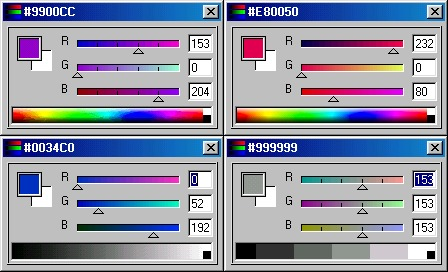



## vRGBSliders Ver 1\.03

### Description

COOL! Active X Control RGB Color Picker Photoshop Style.VOTE PLEASE!New In This Version Right Click Menu Over Color Picker Lets You Choose Between

Web Safe And Non- Web Safe And Color Or Gray Scale

Also Change A Few Misc.. Items.

PLEASE VOTE FOR ME!

Also

COMMENTS AND SUGESSTIONS APPRECIATED!
 
### More Info
 

             |
---                |---
**Submitted On**   |2001-06-30 02:24:02
**By**             |[Vince Foster](https://github.com/Planet-Source-Code/PSCIndex/blob/master/ByAuthor/vince-foster.md)
**Level**          |Intermediate
**User Rating**    |5.0 (25 globes from 5 users)
**Compatibility**  |VB 6\.0
**Category**       |[OLE/ COM/ DCOM/ Active\-X](https://github.com/Planet-Source-Code/PSCIndex/blob/master/ByCategory/ole-com-dcom-active-x__1-29.md)
**World**          |[Visual Basic](https://github.com/Planet-Source-Code/PSCIndex/blob/master/ByWorld/visual-basic.md)
**Archive File**   |[vRGBSlider22028712001\.zip](https://github.com/Planet-Source-Code/vince-foster-vrgbsliders-ver-1-03__1-24517/archive/master.zip)

